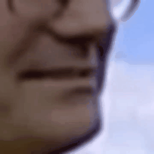

# CNVSRC2025: Official Baseline System

Welcome to the official baseline system for **CNVSRC2025**. This repository provides the starter code, pretrained models, and data processing tools for two major tracks in the competition: Visual Speech Recognition (VSR) and Video-to-Speech (VTS).

<div align="center">
    
</div>

---

## 🏁 About CNVSRC2025

CNVSRC2025 is a national-level challenge focused on **visual-based speech processing for Chinese**, aiming to promote advancements in lip-reading and silent speech generation technologies. Participants are encouraged to explore deep learning, multi-modal modeling, and generative methods in real-world noisy and unconstrained video scenarios.

---

## 📂 Available Tracks

### 🔹 1. Chinese Visual Speech Recognition (VSR)

This track requires models to **predict Chinese characters** from silent video input of a speaker's face. The main challenges include modeling subtle lip movements, handling visually similar phonemes, and dealing with variable lighting or occlusion.

🔗 **[Access VSR Track Code and Details](https://github.com/liu12366262626/CNVSRC2025/tree/main/VSR)**

Key components:
- Face and mouth ROI extraction
- Visual encoders (CNN, Transformer, Conformer, etc.)
- Sequence modeling with CTC loss
- Decoding and evaluation scripts (CER)

---

### 🔹 2. Chinese Video-to-Speech Synthesis (VTS)

In this track, participants must generate **intelligible and natural-sounding speech** from silent talking-head videos. The task focuses on prosody, articulation, and speaker similarity based on visual-only cues.

🔗 **[Access VTS Track Code and Details](https://github.com/liu12366262626/CNVSRC2025/tree/main/VTS)**

Key features:
- Video-based encoder extracting lip motion dynamics
- Diffusion-based or neural vocoder speech generation (e.g., HiFi-GAN)
- Support for waveform reconstruction and quality evaluation
- Evaluation metrics include STOI and CER testing

---

## 📦 Dataset & Evaluation

The CNVSRC2025 competition is built upon the **CNVSRC2024 benchmark dataset**, which provides a solid foundation for large-scale visual speech processing research. 

In addition to the original dataset from CNVSRC2024, we have also **released an extra 1000 hours of high-quality audio-visual data**, significantly enhancing the training and evaluation potential for both VSR and VTS tasks.

We provide tools for preprocessing, training, validation, and testing to support streamlined experimentation and reproducibility.

---

## 🚀 Getting Started

Each track includes a detailed `README.md` describing environment setup, dependencies, data preparation, training scripts, and evaluation methods. Please navigate to the respective folders for instructions:

```bash
cd VSR   # for Visual Speech Recognition
cd VTS   # for Video-to-Speech Synthesis -->

